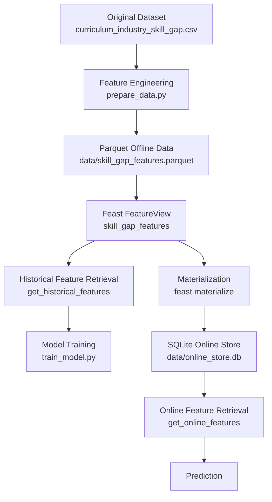

# Curriculum–Industry Skill Feature Store Using Feast

A simple Feast-based feature store for analyzing curriculum–industry skill gaps and predicting whether a student is ready for industry.

## Student Details

| Field | Value |
|---|---|
| Name | Sri Nayana Kanaparthi |
| Register Number | 231FA04C32 |
| Section | 3 |

## Problem Statement

University curricula provide academic knowledge, but they may not always provide the practical skills expected by industry. This project analyzes the difference between curriculum-level skill coverage and industry-level proficiency for students.

The project uses engineered skill-gap features with [Feast](https://feast.dev/). Feast provides:

- Historical feature retrieval for model training.
- Online feature retrieval for prediction.
- Consistent feature definitions across training and serving.
- Point-in-time-correct feature retrieval.

A Logistic Regression model uses the retrieved features to predict whether a student is industry-ready.

## Dataset

### Dataset Information

| Property | Description |
|---|---|
| Dataset name | `curriculum_industry_skill_gap.csv` |
| Dataset type | Synthetic dataset created for academic demonstration |
| Number of records | 80 |
| Number of skills | 5 |
| Entity | `student_id` |
| Timestamp | `event_timestamp` |
| Target | `target_readiness` |

Each row represents a student assessment at a particular timestamp.

### Evaluated Skills

The dataset evaluates the following five skills:

1. Python
2. SQL
3. Machine Learning
4. Cloud Computing
5. Communication

Each skill has two ratings on a scale from 1 to 5:

- Curriculum rating: academic coverage of the skill.
- Industry rating: practical proficiency expected by industry.

### Dataset Columns

| Column | Description |
|---|---|
| `student_id` | Unique student identifier and Feast entity key |
| `event_timestamp` | Timestamp of the student assessment |
| `curriculum_track` | Student's academic or technical track |
| `python_curriculum` | Curriculum rating for Python |
| `python_industry` | Industry proficiency rating for Python |
| `sql_curriculum` | Curriculum rating for SQL |
| `sql_industry` | Industry proficiency rating for SQL |
| `ml_curriculum` | Curriculum rating for machine learning |
| `ml_industry` | Industry proficiency rating for machine learning |
| `cloud_curriculum` | Curriculum rating for cloud computing |
| `cloud_industry` | Industry proficiency rating for cloud computing |
| `communication_curriculum` | Curriculum rating for communication |
| `communication_industry` | Industry proficiency rating for communication |
| `internship_months` | Duration of internship exposure |
| `projects_completed` | Number of relevant projects completed |
| `certification_count` | Number of relevant certifications |
| `industry_experience_months` | Industry experience in months |
| `target_readiness` | Target label: `0` means not ready and `1` means industry-ready |

### Data Generation

The dataset is synthetic and was generated with realistic ranges for:

- Academic skill ratings.
- Industry skill ratings.
- Internship experience.
- Completed projects.
- Certifications.
- Industry experience.

The `target_readiness` label was generated from a weighted readiness score based on:

- Industry proficiency.
- Project experience.
- Internship exposure.
- Certifications.
- Industry experience.
- Skill gaps.

The target column is used as the model label and is intentionally excluded from the Feast `FeatureView` to prevent target leakage.

## Feature Engineering

Feature engineering is performed by `prepare_data.py`.

The script reads the original CSV file and writes the engineered features to:

```text
data/skill_gap_features.parquet
```

### Skill-Gap Calculation

For every skill, the gap is calculated as:

```text
skill_gap = curriculum_rating - industry_rating
```

For example:

```text
python_gap = python_curriculum - python_industry
```

A positive value means that curriculum coverage is higher than practical industry proficiency for that skill.

If:

```text
python_curriculum = 5
python_industry = 3
```

Then:

```text
python_gap = 5 - 3 = 2
```

### Engineered Features

| Feature | Description |
|---|---|
| `python_gap` | Difference between Python curriculum and industry ratings |
| `sql_gap` | Difference between SQL curriculum and industry ratings |
| `ml_gap` | Difference between machine-learning curriculum and industry ratings |
| `cloud_gap` | Difference between cloud curriculum and industry ratings |
| `communication_gap` | Difference between communication curriculum and industry ratings |
| `average_skill_gap` | Average gap across all five skills |
| `industry_skill_average` | Average industry rating across all five skills |
| `projects_completed` | Number of completed practical projects |
| `internship_months` | Number of months of internship exposure |
| `certification_count` | Number of industry-related certifications |
| `industry_experience_months` | Industry experience in months |
| `project_experience_score` | Normalized project score between 0 and 1 |
| `internship_experience_score` | Normalized internship score between 0 and 1 |
| `certification_score` | Normalized certification score between 0 and 1 |
| `industry_experience_score` | Normalized industry experience score between 0 and 1 |

The target feature, `target_readiness`, is intentionally excluded from the `FeatureView` because it is the prediction label.

## Feast Architecture



### Workflow

1. The original CSV dataset is read by `prepare_data.py`.
2. Skill gaps and normalized experience features are calculated.
3. The engineered features are written to a Parquet file.
4. Feast registers the entity and `FeatureView`.
5. Historical features are retrieved for model training.
6. The feature values are materialized into the SQLite online store.
7. Online features are retrieved using the student entity key.
8. The trained Logistic Regression model generates a prediction.

## Feast Implementation

### Entity

The Feast entity is `student`.

Its join key is `student_id`, which uniquely identifies each student record for feature retrieval.

```python
student = Entity(
    name="student",
    join_keys=["student_id"],
    description="Student skill-gap entity",
)
```

### Data Source

The data source is a local Parquet file created by `prepare_data.py`:

```text
data/skill_gap_features.parquet
```

The Feast `FileSource` uses `event_timestamp` to perform time-aware historical joins.

### FeatureView

The `FeatureView` is named `skill_gap_features`.

It contains:

- Engineered skill-gap features.
- Industry skill averages.
- Practical experience features.
- Normalized experience scores.

The `FeatureView` is online-enabled so that its values can be materialized into the SQLite online store and retrieved during prediction.

### FeatureView Features

```text
python_gap
sql_gap
ml_gap
cloud_gap
communication_gap
average_skill_gap
industry_skill_average
projects_completed
internship_months
certification_count
industry_experience_months
project_experience_score
internship_experience_score
certification_score
industry_experience_score
```

## Historical Feature Retrieval

Historical features are retrieved using Feast's `get_historical_features()` method:

```python
historical_df = store.get_historical_features(
    features=feature_refs,
    entity_df=entity_df,
).to_df()
```

The entity dataframe contains:

```text
student_id
event_timestamp
target_readiness
```

The resulting historical dataframe is used to train the machine-learning model.

Example generated columns include:

```text
student_id
event_timestamp
python_gap
sql_gap
ml_gap
cloud_gap
communication_gap
average_skill_gap
industry_skill_average
projects_completed
internship_months
certification_count
industry_experience_months
target_readiness
```

The historical feature output is stored at:

```text
data/historical_features.parquet
```

## Model

A Logistic Regression model is trained using the historical features retrieved through Feast.

The model pipeline consists of:

1. `StandardScaler`
2. `LogisticRegression`

The target label is:

```text
target_readiness
```

The target values have the following meaning:

| Value | Meaning |
|---|---|
| `0` | Student is not predicted to be industry-ready |
| `1` | Student is predicted to be industry-ready |

### Model Accuracy

```text
Model accuracy: 0.9000
```

The reported accuracy is based on the synthetic dataset and should not be interpreted as production-level performance.

## Online Feature Retrieval

After materialization, Feast loads the engineered feature values from the offline Parquet source into the SQLite online store.

The online features are retrieved for a student using:

```python
online_data = store.get_online_features(
    features=feature_refs,
    entity_rows=[
        {
            "student_id": "S080"
        }
    ],
).to_dict()
```

### Online Feature Output

The following features were retrieved for student `S080`:

| Feature | Retrieved value |
|---|---:|
| `student_id` | `S080` |
| `internship_months` | 4 |
| `industry_skill_average` | 1.6 |
| `projects_completed` | 4 |
| `sql_gap` | -1.0 |
| `certification_score` | 0.5 |
| `industry_experience_score` | 0.166667 |
| `python_gap` | 1.0 |
| `cloud_gap` | 0.0 |
| `internship_experience_score` | 0.333333 |

The complete online feature output contained 16 columns. Pandas abbreviated some columns when displaying the dataframe.

The online feature retrieval successfully returned the latest materialized feature values for student `S080`. These values were then passed to the trained model for prediction.

## Final Prediction

| Field | Value |
|---|---|
| Student | `S080` |
| Final prediction | `0` |
| Readiness probability | `0.0002` |

### Interpretation

Student `S080` is predicted as **not industry-ready** by the trained model and may require additional practical training.

The student could benefit from:

- More industry-oriented projects.
- Additional internship exposure.
- Practical skill development in areas with larger skill gaps.
- Industry-relevant certifications.
- Improved hands-on experience with cloud computing, SQL, Python, or machine learning.

## Execution Instructions

### Install Dependencies

Install the required Python packages using:

```bash
pip install -r requirements.txt
```

For Google Colab, use:

```python
!pip install -q feast==0.53.0 pandas pyarrow scikit-learn joblib
```

### Step 1: Engineer Features

Run:

```bash
python prepare_data.py
```

This creates:

```text
data/skill_gap_features.parquet
```

### Step 2: Register Feast Objects

Run:

```bash
feast apply
```

This registers the following Feast objects:

- Student entity.
- Parquet data source.
- `skill_gap_features` FeatureView.
- Feature-store metadata in the Feast registry.

### Step 3: Retrieve Historical Features

Run:

```bash
python historical_features.py
```

This creates:

```text
data/historical_features.parquet
```

### Step 4: Materialize Features

Run:

```bash
feast materialize 2026-01-01T00:00:00 2026-12-31T23:59:59
```

This loads feature values into:

```text
data/online_store.db
```

### Step 5: Train the Model

Run:

```bash
python train_model.py
```

This retrieves the historical features and trains the Logistic Regression model.

### Step 6: Retrieve Online Features and Predict

Run:

```bash
python online_features.py
```

This retrieves the online features for student `S080` and generates the final readiness prediction.

## Required Analysis Answers

### 1. What is the entity in the Feast implementation?

The entity is `student`.

The entity join key is `student_id`, which uniquely identifies each student record for feature retrieval.

### 2. What features are stored in the FeatureView?

The `skill_gap_features` FeatureView stores:

```text
python_gap
sql_gap
ml_gap
cloud_gap
communication_gap
average_skill_gap
industry_skill_average
projects_completed
internship_months
certification_count
industry_experience_months
project_experience_score
internship_experience_score
certification_score
industry_experience_score
```

The `target_readiness` label is not stored in the FeatureView.

### 3. How was one feature calculated?

The `python_gap` feature was calculated as:

```text
python_gap = python_curriculum - python_industry
```

For example, if:

```text
python_curriculum = 5
python_industry = 3
```

Then:

```text
python_gap = 5 - 3 = 2
```

A positive value indicates that the curriculum rating is higher than the student's practical industry proficiency.

### 4. What is the difference between the original dataset and the feature dataset?

The original dataset contains:

- Raw curriculum ratings.
- Raw industry proficiency ratings.
- Student experience information.
- The target readiness label.

The feature dataset contains transformed and engineered values such as:

- Skill gaps.
- Average skill gap.
- Industry skill average.
- Normalized project experience.
- Normalized internship experience.
- Normalized certification experience.
- Normalized industry experience.

The feature dataset is stored in Parquet format and is used as the Feast offline data source.

### 5. What is the purpose of the offline store?

The offline store keeps historical feature data.

It is used to:

- Create training datasets.
- Perform point-in-time feature retrieval.
- Support batch model training.
- Preserve feature values across historical timestamps.

In this project, the engineered Parquet file acts as the offline data source.

### 6. What is the purpose of the online store?

The online store keeps the latest materialized feature values for fast retrieval during prediction.

In this project, SQLite is used as the local online store:

```text
data/online_store.db
```

### 7. What is the purpose of `feast apply`?

The `feast apply` command reads the Feast definitions and registers or updates:

- The entity.
- The data source.
- The FeatureView.
- The metadata in the Feast registry.

It creates the metadata required by the feature store.

### 8. What does materialization do?

Materialization copies feature values from the offline data source into the online store for a specified time range.

After materialization, the model can retrieve feature values using an entity key such as:

```text
student_id
```

For example:

```text
S080
```

### 9. What is the advantage of retrieving features through Feast?

Feast provides a consistent feature definition for both training and prediction.

This helps reduce training-serving skew because the same feature names, definitions, and transformations are used in both workflows.

Feast also supports point-in-time-correct historical retrieval. This reduces the risk of using information during training that would not have been available at the time of prediction.

### 10. What are two limitations of the current dataset?

The current dataset has the following limitations:

1. It is synthetic and may not represent the full complexity of real student performance or industry requirements.
2. It contains only five skills and a limited number of student records, so the model may not generalize well to different institutions, job roles, or industries.

Additional limitations include:

- The target label is synthetically generated.
- The dataset does not include detailed job-role information.
- The model has not been evaluated on an independent real-world dataset.
- A single accuracy value may not fully represent model performance.

### 11. How could the feature store be improved when more evidence becomes available?

The feature store could be improved in the following ways:

1. Add real evidence from job descriptions, internship evaluations, employer surveys, coding assessments, project repositories, placement outcomes, and technical interviews.
2. Add detailed and time-dependent features such as skill assessment history, changing job-market demand, course completion dates, project quality scores, and skill improvement trends.
3. Create separate FeatureViews for different job roles, such as data analyst, software developer, machine-learning engineer, cloud engineer, and business analyst.
4. Add data validation, feature monitoring, feature versioning, and model-performance monitoring.
5. Use a scalable online store and production-grade access-control mechanisms.

## Limitations

This project is intended for local educational demonstration.

It uses:

- A synthetic dataset.
- A local Parquet offline source.
- SQLite as the online store.
- A small number of records.
- A Logistic Regression model.

A production system would require:

- Real student and industry evidence.
- Stronger data validation.
- Access control.
- Feature versioning.
- Data quality monitoring.
- Model monitoring.
- Bias and fairness evaluation.
- Scalable online infrastructure.
- Secure handling of student data.
- Regular updates based on changing industry requirements.

## Repository Files

The repository contains the following source files:

```text
curriculum_industry_skill_gap.csv
prepare_data.py
feature_definitions.py
feature_store.yaml
requirements.txt
README.md
```

### Generated Local Files

The following files are generated locally and should not be committed to the repository:

```text
data/registry.db
data/online_store.db
__pycache__/
.venv/
```

A suitable `.gitignore` file can include:

```gitignore
data/registry.db
data/online_store.db
__pycache__/
.venv/
*.pyc
```

## Conclusion

This project demonstrates how Feast can be used to build a feature store for curriculum–industry skill-gap analysis.

The workflow transforms raw student assessment data into reusable features, stores them in an offline Parquet source, materializes them into an online SQLite store, and retrieves them for machine-learning prediction.

The Logistic Regression model achieved an accuracy of `0.9000` on the synthetic dataset. For student `S080`, the model predicted that the student is not currently industry-ready, with a readiness probability of `0.0002`.

The project provides a foundation for extending the feature store with real-world curriculum data, industry requirements, job-role-specific features, and continuously updated student skill assessments.
